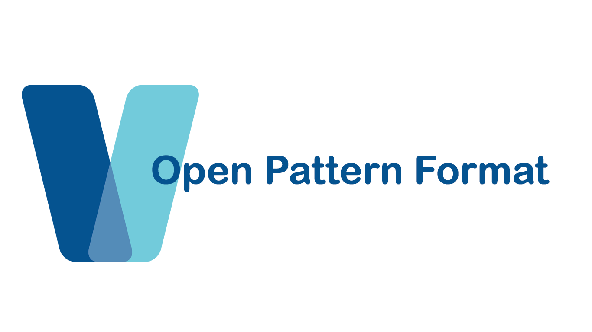

# 

Welcome to the home of the Open Pattern Format documentation. Here you will find everything you need relating to the Open Pattern Format whether you are a yarn crafter, designer or developer.

## Overview
The Open Pattern Format or OPAF for short is a comprehensive file format specification for digital yarn craft patterns and projects. The specification covers all elements which make up your average pattern including metadata, components, instructions and charts.

## Features
* Structured metadata
* Configurable & customisable
* Standardised terminology
* Interactive instructions & charts
* Project tracking
* XML based (can be read in any text editor)
* Free, open source & permissive
